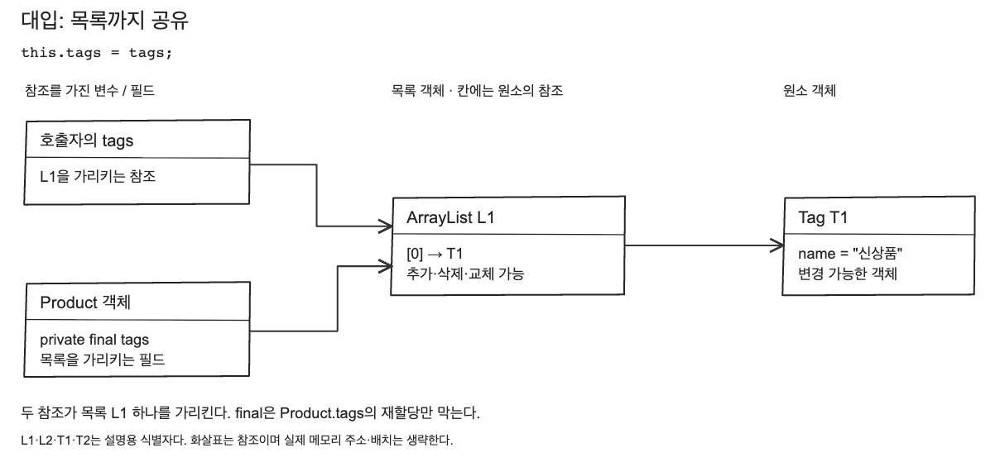
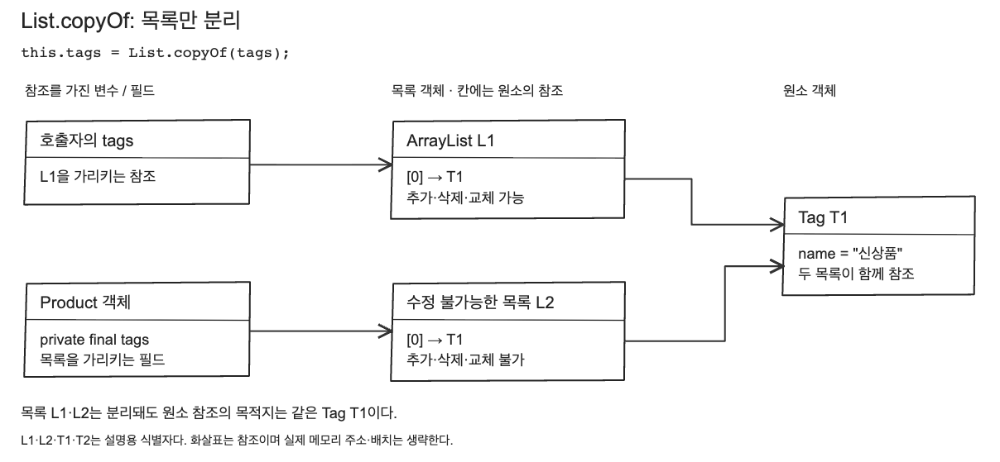
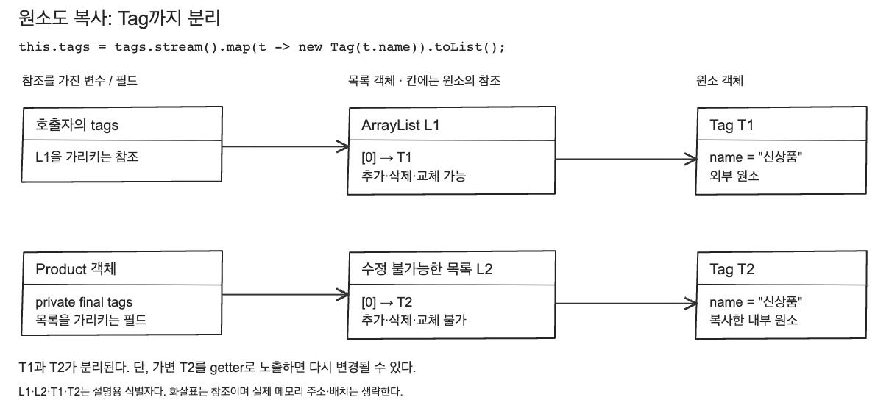

# 변경 가능한 상태 줄이기

학습일: 2026-09-15 · 학습 순서 16 · 아이템 17: 변경 가능성을 최소화하라

## 핵심 결론

불변 객체는 생성된 뒤 상태가 바뀌지 않는 객체다. 변경된 값이 필요하면 기존 객체를 수정하는 대신 새 객체를 반환한다. 이를 통해 여러 곳에서 같은 객체를 공유할 때 변경의 영향을 추적해야 하는 부담을 줄일 수 있다.

필드에 final을 붙이거나 setter를 없애는 것만으로 충분하지는 않다. 외부에서 보유한 참조와 getter를 통해 내부의 가변 객체를 바꿀 수 있는지도 확인해야 한다. 아래 그림은 대화에서 사용한 자료이며, [실습 기록](실습%20기록.md)에 연결된 Java 코드로 동작을 검증했다.

## 불변 객체를 만드는 기준

- 생성자에서 유효한 상태를 만들고 상태 변경 메서드를 제공하지 않는다.
- 필드를 private final로 두어 직접 접근과 재할당을 제한한다.
- final 클래스처럼 하위 클래스가 동작을 바꾸지 못하는 구조를 검토한다.
- 가변 객체를 필드로 보유한다면 외부 참조를 통해 변경되지 않게 보호한다.

앞서 만든 ProductCode는 final 클래스와 private final String 필드를 사용한다. String 자체가 불변이고 변경 메서드가 없어 비교 기준이 유지된다. HashSet의 원소나 HashMap의 키로 사용할 때 값이 바뀌어 조회가 깨지는 문제도 피할 수 있다.

## Java는 객체 전체가 아니라 참조 값을 전달한다

참조 타입 변수에는 객체를 가리키는 참조 값이 들어간다. `new Product(tags)`를 호출하면 그 참조 값이 매개변수로 복사된다. Java는 값 전달이며, 객체 전체를 자동 복제하거나 호출자의 변수 자체를 넘기는 방식이 아니다.

목록의 원소도 참조 타입이면 해당 객체를 가리킨다. `get(0)`은 첫 번째 원소의 참조를 반환한다. 따라서 목록을 수정하지 않고도 그 참조를 통해 원소 객체의 필드를 바꿀 수 있다.

아래는 JVM의 참조 관계를 단순화한 그림이다. 객체는 JVM의 힙에서 관리하는 대상으로 설명할 수 있지만 실제 저장 배치와 JIT 최적화는 생략했다. 모든 참조가 스택에 있다는 뜻도 아니다. 특히 `Product.tags`는 객체 내부의 필드다. L1·L2·T1·T2는 주소가 아닌 설명용 식별자다.

## 1. 그대로 대입하면 목록까지 공유한다

```java
this.tags = tags;
```



외부 변수와 Product 필드가 같은 목록 L1을 가리킨다. 외부에서 `tags.clear()`를 호출하면 Product가 보는 목록도 비워진다. final은 Product의 필드가 다른 목록을 가리키도록 재할당하는 것을 제한할 뿐, L1이나 T1의 상태를 동결하지 않는다.

record의 컴포넌트 필드도 final이지만 참조 대상까지 자동으로 불변이 되지는 않는다. 실습의 테스트 전용 `Tags` record는 전달받은 가변 목록을 그대로 보유하므로 같은 문제가 발생한다.

## 2. List.copyOf는 목록을 보호하지만 원소까지 복사하지 않는다

```java
this.tags = List.copyOf(tags);
```



그림은 ArrayList를 입력으로 사용한 경우다. L1을 수정해도 L2의 원소 구성은 바뀌지 않고, L2에서 추가·삭제·교체를 시도하면 UnsupportedOperationException이 발생한다. 하지만 두 목록은 같은 Tag T1을 참조한다.

```java
tag.name = "할인";                  // T1 자체 변경: 양쪽에서 보인다.
product.tags().get(0).name = "추천"; // getter로 받은 원소도 가변이면 수정할 수 있다.
```

`List.copyOf()`는 null 목록과 null 원소를 거절한다. 항상 새 인스턴스를 생성해야 한다는 계약은 아니며 적합한 수정 불가능 목록은 재사용할 수 있다. 중요한 보장은 원본 목록의 이후 구조 변경이 반환 목록에 반영되지 않고 반환 목록 자체를 수정할 수 없다는 점이다.

## 3. 원소도 복사하면 외부 원소와 분리된다

```java
this.tags = tags.stream().map(t -> new Tag(t.name)).toList();
```



새 Tag를 만들면 외부 T1을 변경해도 내부 T2의 이름은 그대로다. 이 예제의 Tag는 String 필드 하나이며, 위 코드는 임의의 객체 그래프를 재귀적으로 복사하는 범용 코드가 아니다.

복사한 T2도 가변 객체라면 getter를 통해 T2를 노출했을 때 다시 변경될 수 있다. 원소를 불변 타입으로 설계하거나 입력·출력 양쪽에서 필요한 방어적 복사를 검토해야 한다. 원소 복사만으로 Product 전체의 불변성이 자동 보장되는 것은 아니다.

[세 단계를 조작하는 HTML](images/java-references.html)에서 외부 Tag 이름을 변경하고 내부 결과를 비교할 수 있다. GitHub에서는 HTML을 내려받아 브라우저에서 열면 된다. [그림 1 SVG](images/java-references-1.svg) · [그림 2 SVG](images/java-references-2.svg) · [그림 3 SVG](images/java-references-3.svg)는 확대용 원본이다.

## String 원소는 공유해도 변경할 수 없다

실제 실습의 Product는 `List<String>`을 `List.copyOf()`로 보관한다. String 자체는 내용을 변경할 수 없으므로 원소 참조를 공유해도 문제가 없다. getter에서 그 목록을 그대로 반환해도 목록과 원소를 수정할 수 없다.

원본 목록의 `tags.set(0, "할인")`은 String을 수정하는 것이 아니라 L1의 첫 번째 참조를 다른 String으로 교체하는 것이다. L2의 칸은 바뀌지 않는다. final 참조, 수정 불가능 목록, 불변 원소가 각각 무엇을 제한하는지 구분한다.

## 변경된 값은 새 객체로 반환한다

실습의 Price는 음수가 아닌 정수 가격을 보관한다. `discount()`는 할인액을 검증하고 할인 후 가격을 담은 새 객체를 반환한다.

```java
var original = new Price(10000);
var discounted = original.discount(1000);
// original.amount(): 10000, discounted.amount(): 9000
```

할인액이 음수이거나 원래 가격보다 크면 예외를 던지고 기존 상태는 유지된다. 0원과 전액 할인도 허용한다. 이 실습은 상태 변경 방식을 설명하는 예제이며 가격의 equals·hashCode나 통화·소수점 규칙까지 구현하지 않는다.

```java
Price price = new Price(10000);
price = price.discount(1000);
```

이 코드 역시 불변 객체 사용이다. 기존 Price가 변경된 것이 아니라 변수 price가 새 Price를 가리키게 된 것이다. 객체의 불변성과 지역 변수의 재할당은 별개다.

## 이점과 비용, 다음 학습

불변 객체는 공유와 상태 추적을 단순하게 만든다. 대신 새 객체 생성과 데이터 복사 비용이 발생할 수 있다. 변경이 잦고 큰 데이터를 다룬다면 가변 객체로 작업한 뒤 불변 결과를 만드는 방식도 검토한다. 앞서 배운 빌더가 여기에 연결된다. 실제 성능은 이번에 측정하지 않았다.

불변 객체를 사용해도 가변 목록 자체나 공유 변수의 갱신까지 자동으로 안전해지지는 않는다. JPA 엔티티처럼 변경이 필요한 대상도 있으므로 모든 객체에 불변성을 일괄 적용하는 규칙으로 해석하지 않는다.

다음 학습 순서 17, 아이템 50은 입력과 출력 경계에서 방어적 복사를 언제 해야 하는지 다룬다. 이번에는 연결 개념을 설명했으며 17번 전체 학습과 실습을 완료한 것은 아니다.

근거: [Java 21 List.copyOf](https://docs.oracle.com/en/java/javase/21/docs/api/java.base/java/util/List.html#copyOf(java.util.Collection)) · [Java 언어 명세의 final 변수](https://docs.oracle.com/javase/specs/jls/se21/html/jls-4.html#jls-4.12.4)

[공부 목표](공부%20목표.md) · [실습 기록](실습%20기록.md) · [30선 전체 목록](../공부%20목표.md)
