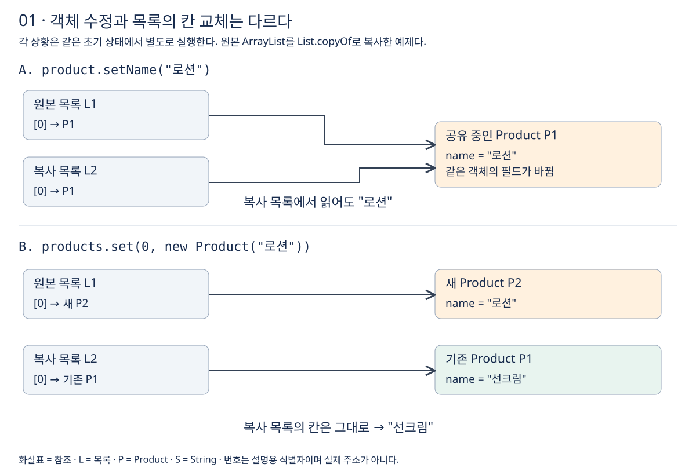
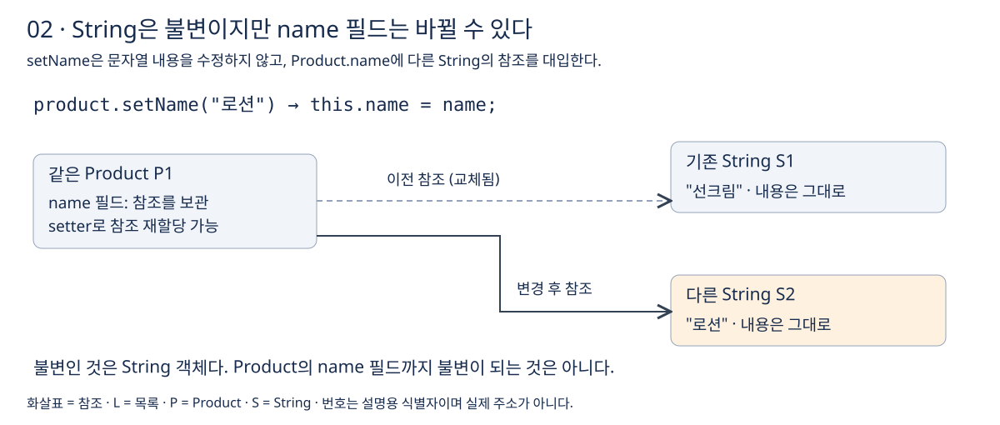
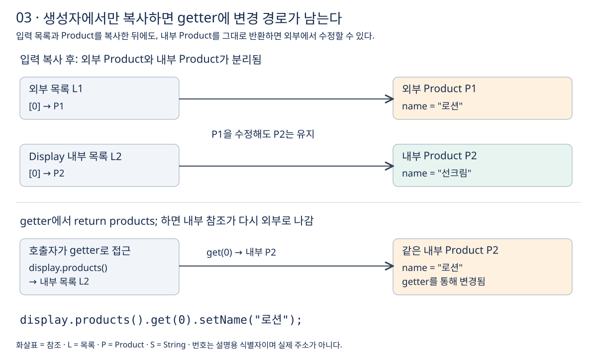
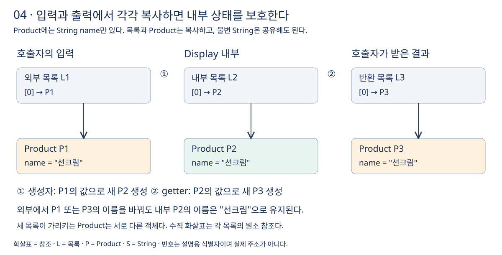
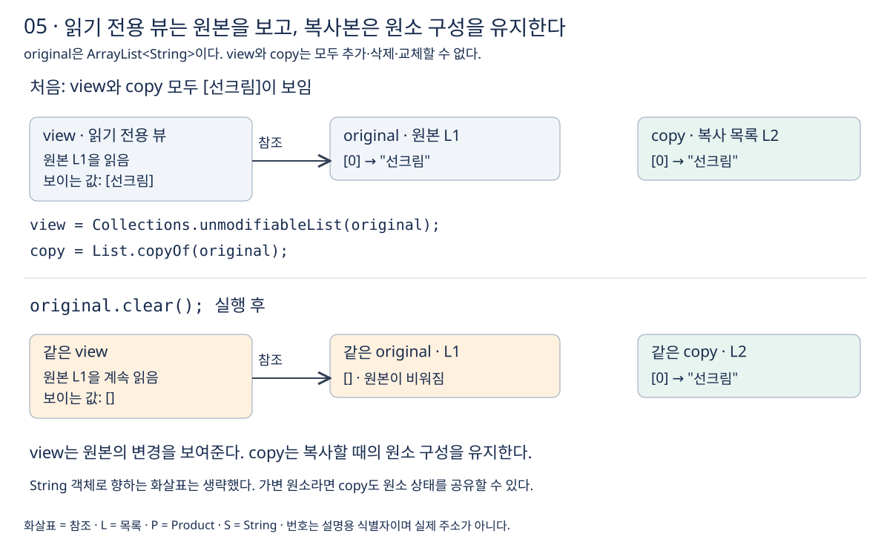

# 외부 참조로부터 내부 상태 보호

학습일: 2026-09-19 · 학습 순서 17 · 아이템 50: 적시에 방어적 복사본을 만들라

## 먼저 기억할 기준

방어적 복사는 외부 코드가 보유한 참조를 통해 내부 상태가 바뀌는 것을 막기 위한 복사다. **생성자로 들어오는 참조와 getter로 나가는 참조를 모두 확인한다.**

16번에서는 불변 객체와 참조 공유를 살펴봤다. 이번에는 대화에서 헷갈렸던 객체 수정과 목록의 칸 교체를 구분하고, 입력·출력 경계에서 무엇을 복사해야 하는지 정리한다.

그림의 화살표는 참조이며 실제 메모리 배치를 나타내지 않는다. L1·P1·S1 등의 번호는 설명용 식별자다. 그림별 예제는 독립적이며, Product에는 String 타입의 name 필드만 있다고 가정한다.

## 1. 생성자에서 목록만 복사하면 무엇이 해결될까?

```java
public Display(List<String> products) {
    this.products = new ArrayList<>(products);
}

public List<String> products() {
    return products;
}
```

생성자에서 별도 목록을 만들었으므로 원래 전달한 목록에 `clear()`를 호출해도 내부 목록은 유지된다. 하지만 `display.products().add("로션")`은 내부 목록을 바꾼다. getter가 내부 목록을 그대로 반환하기 때문이다.

`private final`은 필드의 직접 접근과 재할당을 제한한다. 참조 대상인 목록의 내용까지 동결하지는 않는다.

## 2. 객체 수정과 목록의 칸 교체는 다르다

다음은 두 상황에 공통으로 사용하는 초기 상태다. A와 B는 이 초기 상태에서 **각각 별도로 실행**한다.

```java
Product product = new Product("선크림");
List<Product> products = new ArrayList<>();
products.add(product);

List<Product> copied = List.copyOf(products);
```



### A. 공유 중인 Product를 수정한다

```java
product.setName("로션");
System.out.println(copied.get(0).getName()); // 로션
```

두 목록이 같은 Product를 가리킨다. Product 내부의 이름이 바뀌면 어느 목록을 통해 읽어도 바뀐 이름이 보인다.

### B. 원본 목록의 칸을 새 Product로 교체한다

```java
products.set(0, new Product("로션"));
System.out.println(copied.get(0).getName()); // 선크림
```

원본 목록의 0번 칸만 새 Product를 가리킨다. 복사 목록의 0번 칸은 여전히 기존 Product를 가리킨다.

**목록의 원소 구성은 분리돼도, 처음 담긴 객체는 공유한다.** 이것이 이번 예제에서 얕은 복사를 이해하는 기준이다.

| 동작 | 변경되는 대상 | 복사 목록에서 읽는 이름 |
| --- | --- | --- |
| `product.setName("로션")` | 공유 중인 Product의 필드 | 로션 |
| `products.set(0, new Product("로션"))` | 원본 목록의 0번 칸 | 선크림 |
| `products.clear()` | 원본 목록의 원소 구성 | 선크림 — 복사 목록의 원소는 남음 |

## 3. String이 불변인데 왜 이름은 바뀔까?



```java
public void setName(String name) {
    this.name = name;
}
```

setter는 기존 `"선크림"` 문자열의 내용을 수정하지 않는다. Product의 name 필드에 `"로션"` 문자열을 가리키는 참조를 대입한다. **String 객체의 불변성과 Product 필드의 재할당은 서로 다르다.**

따라서 `List<String>`과 `List<Product>`의 차이는 다음과 같다.

- `List<String>`: 공유한 String 자체를 변경할 수 없다. 목록의 칸 교체와 문자열 객체의 수정은 다르다.
- `List<Product>`: 목록을 수정하지 않아도 공유 중인 Product의 setter를 호출할 수 있다.

## 4. 입력에서 Product까지 복사해도 getter를 확인해야 한다

```java
public Display(List<Product> products) {
    this.products = products.stream()
            .map(product -> new Product(product.getName()))
            .toList();
}
```

이제 외부 Product P1과 내부 Product P2가 별개다. 외부에서 P1의 이름을 바꿔도 내부 P2는 유지된다. String은 불변이므로 이름의 String 참조는 공유해도 된다.



그런데 getter가 `return products;`라면 아래 코드는 내부 P2를 수정한다.

```java
display.products().get(0).setName("로션");
```

`Stream.toList()`가 반환한 목록은 수정 불가능하지만, 그 안의 가변 Product까지 불변으로 만들지는 않는다. 생성자에서만 복사하면 출력 경로에 문제가 남을 수 있다.

## 5. 입력과 출력에서 각각 필요한 객체를 복사한다



아래는 위 그림에 대응하는 설명용 코드다. 입력 목록과 원소는 null이 아니라고 가정하며, 실제 Java Lab 파일로 추가하거나 실행한 코드는 아니다.

```java
import java.util.List;

public final class Display {
    private final List<Product> products;

    public Display(List<Product> products) {
        this.products = copyProducts(products);
    }

    public List<Product> products() {
        return copyProducts(products);
    }

    private static List<Product> copyProducts(List<Product> products) {
        return products.stream()
                .map(product -> new Product(product.getName()))
                .toList();
    }
}
```

예제의 Product는 다음처럼 이름을 변경할 수 있는 단순한 타입이다.

```java
public final class Product {
    private String name;

    public Product(String name) {
        this.name = name;
    }

    public String getName() {
        return name;
    }

    public void setName(String name) {
        this.name = name;
    }
}
```

생성자는 외부 P1의 값으로 내부 P2를 만든다. getter는 내부 P2의 값으로 반환용 P3를 만든다. 호출자가 P1이나 P3를 수정해도 P2의 상태는 유지된다.

이 복사는 name만 있는 Product를 위한 것이다. Product에 가변 목록이나 다른 가변 객체가 추가되면 그 참조도 다시 확인해야 한다. 임의의 객체 구조를 모두 복사하는 범용 깊은 복사 코드는 아니다.

## 6. 읽기 전용 뷰와 복사는 다르다

`Collections.unmodifiableList()`는 원본 목록을 읽는 창을 제공한다. 이 창을 통해 추가·삭제·교체할 수는 없지만, 다른 코드가 원본 목록을 바꾸면 그 변경이 보인다. `List.copyOf()`는 복사 시점의 원소 구성을 유지한다.

```java
List<String> original = new ArrayList<>();
original.add("선크림");

List<String> view = Collections.unmodifiableList(original);
List<String> copy = List.copyOf(original);

original.clear();

System.out.println(view); // []
System.out.println(copy); // [선크림]
```



`view.add("로션")`과 `copy.add("로션")`은 모두 `UnsupportedOperationException`을 던진다. 그러나 `original.clear()`의 영향은 서로 다르다. **반환받은 목록을 수정할 수 없다는 것과 그 목록의 내용이 이후에도 유지된다는 것은 별개의 보장이다.**

원본의 최신 내용을 계속 보여주되 호출자의 수정을 막으려면 읽기 전용 뷰를 사용할 수 있다. 생성 당시의 원소 구성을 유지하려면 복사를 검토한다. 다만 `List<Product>`처럼 원소가 가변이면 `List.copyOf()`도 원소의 상태까지 고정하지는 않는다.

근거: [Java 21 Collections.unmodifiableList](https://docs.oracle.com/en/java/javase/21/docs/api/java.base/java/util/Collections.html#unmodifiableList(java.util.List)).

## 7. 가변 입력은 복사한 뒤 복사본을 검증한다

진열 상품 이름이 최소 하나는 있어야 한다는 규칙을 생각해 보자. 아래는 검증 대상과 실제 저장 대상이 달라질 수 있는 순서다.

```java
public Display(List<String> products) {
    if (products.isEmpty()) {
        throw new IllegalArgumentException("진열 상품이 필요합니다.");
    }
    // 검사와 복사 사이에 다른 스레드가 원본을 비울 수 있다.
    this.products = List.copyOf(products);
}
```

발생 가능한 순서는 `원본 검사 통과 → 다른 스레드가 원본 변경 → 바뀐 원본 복사`다. 그러면 검사한 내용과 저장한 내용이 다를 수 있다. 이런 검사 시점과 사용 시점의 차이를 TOCTOU라고 부른다. 항상 발생한다는 뜻은 아니다.

내부에 보관할 복사본을 먼저 만들고 그 복사본에 업무 규칙을 적용한다.

```java
public Display(List<String> products) {
    List<String> copy = List.copyOf(products);
    if (copy.isEmpty()) {
        throw new IllegalArgumentException("진열 상품이 필요합니다.");
    }
    this.products = copy;
}
```

이제 검증한 목록과 저장하는 목록이 같다. 이 예제는 String 원소가 불변이고 복사 목록도 수정 불가능하므로, 복사 이후 원본 변경으로 검증 결과가 깨지지 않는다. 가변 Product를 검증한다면 목록만 복사해서는 부족하며 검증에 사용하는 가변 상태도 외부와 분리해야 한다.

**방어적 복사가 동시 접근 자체를 안전하게 만드는 것은 아니다.** 다른 스레드가 복사 도중 원본을 변경할 수 있다면 별도의 동기화나 일관된 스냅샷을 제공하는 방식이 필요하다. 여기서의 원칙은 검사한 복사본을 그대로 보관하라는 것이다. null 여부나 입력 크기 제한 같은 사전 확인까지 무조건 복사 뒤로 미루라는 뜻은 아니다.

근거: [Oracle Java 가이드의 가변 입력 복사와 검사 시점 문제](https://www.oracle.com/java/technologies/javase/seccodeguide.html#6-3).

## 8. 복사가 필요한 범위를 선택한다

원소를 불변으로 설계할 수 있다면 더 간단해진다. 예를 들어 `record Product(String name) {}`는 이 필드 구성에서는 불변이다. 생성자에서 `List.copyOf(products)`로 목록을 보관하고 getter로 그 목록을 반환해도 목록과 원소를 수정할 수 없다. record에 가변 필드 타입이 들어가면 같은 결론을 적용할 수 없다.

| 방법 | 원본 목록의 추가·삭제·교체 반영 | 가변 원소 공유 | 반환된 목록 자체 수정 |
| --- | --- | --- | --- |
| 원본 목록 그대로 사용 | 반영됨 | 공유 | 가능 — 원본이 ArrayList인 경우 |
| `Collections.unmodifiableList(original)` | 반영됨 — 원본을 보는 읽기 전용 뷰 | 공유 | 불가 |
| `new ArrayList<>(original)` | 반영 안 됨 | 공유 | 가능 |
| `List.copyOf(original)` | 반영 안 됨 | 공유 | 불가 |
| 새 Product로 매핑 후 `toList()` | 반영 안 됨 | 이 예제의 Product는 분리 | 불가 |

`List.copyOf()`는 null 목록과 null 원소를 거절한다. 항상 새 목록 인스턴스를 만든다는 뜻은 아니며, 적합한 수정 불가능 목록은 재사용할 수 있다. 중요한 것은 원본 목록의 이후 구조 변경이 반영되지 않는다는 보장이다.

가변 Product를 입력·출력마다 복사하면 목록 크기에 비례해 객체 생성과 순회 비용이 든다. 내부 상태를 보호해야 하는 범위를 먼저 정하고, 불변 타입을 공유할 수 있는지도 검토한다. 이번 학습에서 성능은 측정하지 않았다.

복사 범위는 다음 순서로 판단한다.

1. **무엇을 유지해야 하는가?** 원소 구성만인지, 각 상품의 이름 같은 상태까지인지 정한다.
2. **외부에서 무엇을 바꿀 수 있는가?** 원본 목록, 가변 원소, getter로 노출되는 참조를 각각 확인한다.
3. **어디까지 분리하면 되는가?** 목록만 복사하거나, 필요한 가변 원소도 복사한다. String처럼 불변인 값은 공유한다.
4. **자주 복사해야 하는가?** 큰 목록을 자주 반환한다면 불변 원소로 설계해 보관한 목록을 안전하게 공유하는 방식을 검토한다.

복사의 목적은 모든 객체를 새로 만드는 것이 아니라, 보호할 상태에 대한 외부 변경 경로를 끊는 것이다.

## 다음에 직접 확인할 내용

- 생성자에서 목록만 복사했을 때 getter를 통한 변경이 가능한 이유를 설명한다.
- `setName()`과 `set(0, ...)`이 어느 객체를 바꾸는지 그림 없이 설명한다.
- 입력 복사만 있는 경우와 입력·출력 모두 복사한 경우를 코드로 실행해 비교한다.
- 같은 원본으로 만든 읽기 전용 뷰와 복사 목록에 `original.clear()`가 미치는 영향을 비교한다.
- 복사본을 검증해야 하는 이유와, 그것만으로 복사 중 동시 변경까지 해결되지는 않는 이유를 설명한다.

이번 기록은 대화 내용과 SVG 정리다. 17번의 실행 실습과 테스트 검증은 아직 진행하지 않아 상태를 학습 중으로 둔다.

## 참고 자료

- [Java 21 List.copyOf](https://docs.oracle.com/en/java/javase/21/docs/api/java.base/java/util/List.html#copyOf(java.util.Collection))
- [Java 21 Stream.toList](https://docs.oracle.com/en/java/javase/21/docs/api/java.base/java/util/stream/Stream.html#toList())
- [Java 21 Collections.unmodifiableList](https://docs.oracle.com/en/java/javase/21/docs/api/java.base/java/util/Collections.html#unmodifiableList(java.util.List))
- [Oracle Java 가이드: 가변 입력 복사](https://www.oracle.com/java/technologies/javase/seccodeguide.html#6-3)

[공부 목표](공부%20목표.md) · [30선 전체 목록](../공부%20목표.md) · [16번 학습 노트](../16-변경%20가능한%20상태%20줄이기/학습%20노트.md)
