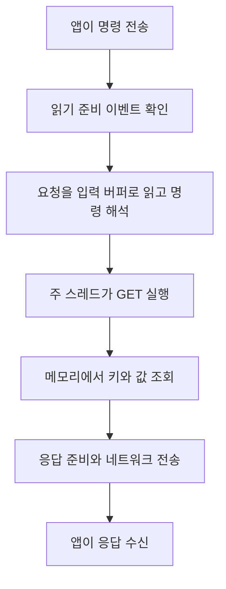

# 1장 Redis의 정체

Redis는 메모리에 데이터를 유지하고, 네트워크로 받은 명령으로 데이터를 읽고 변경하는 서버다. 이번 장에서는 **데이터를 어디에 두는지, 여러 요청을 어떻게 처리하는지, 그래서 왜 빠른지**를 연결해 이해한다. [Redis 소개](https://redis.io/tutorials/what-is-redis/)

## 1 In-memory DB의 의미

**In-memory DB는 실제로 읽고 변경하는 데이터를 RAM에 유지하는 DB다.** Redis의 `GET product:100`은 Redis 프로세스가 관리하는 메모리에서 키를 찾아 값을 읽는다. 앱의 메모리와 Redis의 메모리는 별개이며, 앱은 네트워크를 통해 접근한다. [Redis 소개](https://redis.io/tutorials/what-is-redis/)

데이터를 처리하는 위치와 데이터를 보존하는 방법은 구분해야 한다. Redis는 메모리에서 데이터를 처리하면서, 재시작 때 복구할 수 있도록 디스크에 스냅샷인 RDB나 쓰기 기록인 AOF를 남길 수 있다. **In-memory는 디스크를 전혀 사용하지 않는다는 뜻이 아니다.** 복구 가능한 데이터 범위는 영속화 설정에 따라 달라진다. [Redis 영속화](https://redis.io/docs/latest/operate/oss_and_stack/management/persistence/)

### 디스크가 메모리보다 느린 이유

RAM과 저장장치는 하드웨어와 접근 경로가 다르다. RAM에 이미 있는 데이터는 CPU가 메모리 접근 명령으로 읽는다. 파일의 데이터가 메모리에 없다면 운영체제를 통해 저장장치에 읽기를 요청하고, 데이터를 메모리로 가져오는 과정이 필요하다. 일반적인 파일 읽기는 파일 시스템과 장치 드라이버를 거친다. [Linux 메모리 구조](https://www.kernel.org/doc/html/latest/admin-guide/mm/concepts.html), [Linux 파일 시스템 구조](https://www.kernel.org/doc/html/latest/filesystems/vfs.html)

다음은 캐시에 없는 파일 데이터를 읽는 경로를 단순화한 것이다.

```text
메모리 접근: CPU → 메모리에 있는 데이터

파일 읽기:   앱 → 운영체제 → 저장장치에 읽기 요청
                          → 데이터를 메모리로 가져옴 → 앱에서 사용
```

저장장치 자체에도 시간이 걸린다. HDD는 디스크 회전과 헤드 이동이 필요하다. SSD는 움직이는 부품은 없지만, 컨트롤러를 통해 NAND 플래시를 읽는 과정이 필요하며 RAM보다 접근 지연이 크다. [IBM 저장장치 설명](https://www.ibm.com/think/topics/solid-state-drives)

다만 파일을 읽을 때마다 실제 디스크를 읽는 것은 아니다. 운영체제는 파일 데이터를 **페이지 캐시**라는 메모리 공간에 보관해 반복 읽기의 디스크 접근을 줄인다. 관계형 DB도 자체 메모리 버퍼를 사용한다. 따라서 Redis와 관계형 DB의 성능 차이를 메모리와 디스크의 차이 하나로만 설명할 수는 없다. [Linux 페이지 캐시](https://www.kernel.org/doc/html/latest/admin-guide/mm/concepts.html#page-cache), [PostgreSQL 공유 버퍼](https://www.postgresql.org/docs/current/runtime-config-resource.html#RUNTIME-CONFIG-RESOURCE-MEMORY)

## 2 Single-threaded의 의미

Redis OSS의 기본 구조에서 **한 인스턴스의 일반적인 명령은 주 스레드 하나가 순차적으로 실행한다.** 여러 클라이언트가 동시에 연결하고 요청을 보내도, 일반 명령의 실행은 하나씩 진행된다. [Redis 실행 구조](https://redis.io/docs/latest/operate/oss_and_stack/management/optimization/latency/#single-threaded-nature-of-redis)

```text
앱 스레드 A ── INCR count ──┐
                            ├─→ Redis 주 스레드가 명령을 하나씩 실행
앱 스레드 B ── INCR count ──┘
```

**앱의 스레드와 Redis의 명령 실행 스레드는 별개다.** 앱 스레드 A와 B가 병렬로 동작하더라도, 같은 Redis 인스턴스에 보낸 일반 명령은 Redis 쪽에서 순차적으로 실행된다.

Redis 프로세스 전체에 스레드가 하나뿐이라는 뜻도 아니다. 백그라운드 작업과 버전·설정에 따른 네트워크 I/O에는 다른 스레드를 사용할 수 있다. Single-threaded라는 설명의 핵심은 일반 명령의 실행 구조다. [Redis 스레드 설명](https://redis.io/tutorials/what-is-redis/#is-redis-single-threaded)

### 순차 실행과 클라이언트 간 순서 보장

**서로 다른 클라이언트가 보낸 명령은 하나씩 실행되지만, 어느 클라이언트의 명령을 먼저 실행할지는 보장하지 않는다.** 한쪽이 먼저 전송했다는 사실만으로 실행 순서를 가정하면 안 된다. [클라이언트 처리 순서](https://redis.io/docs/latest/develop/reference/clients/#what-order-are-client-requests-served-in)

아래 예제는 같은 Redis 인스턴스에서 `count`의 초기값이 0이며, 다른 변경이나 만료가 없다고 가정한다.

| 상황 | 가능한 실행 순서 | B의 GET 결과 |
| --- | --- | --- |
| A가 `SET count 10`, B가 `GET count`를 서로 조율하지 않고 보냄 | SET → GET 또는 GET → SET | 10 또는 0 |
| A가 SET 성공 응답을 받은 후에 B가 GET을 보내도록 조율함 | SET → GET | 10 |

첫 번째 상황에서도 Redis 안에는 실제 실행 순서가 생긴다. 다만 앱이 원하는 **A → B 순서가 보장되는 것은 아니다.** 두 번째 상황은 앱이 요청 사이에 명확한 선후 관계를 만든 예제다.

### 여러 명령을 묶은 앱 작업

앱 스레드 A가 `GET → 계산 → SET`을 수행해도 세 단계가 통째로 끝날 때까지 다른 클라이언트가 기다리는 것은 아니다. 다음처럼 개별 명령 사이에 다른 명령이 끼어들 수 있다.

```text
A의 GET → B의 GET → A의 SET → B의 SET
```

두 요청이 같은 값 10을 읽고 각각 11을 저장하면 최종값은 11이다. 반면 `INCR`은 읽기와 증가를 하나의 원자적 명령으로 수행하므로 두 번 실행하면 12가 된다. **개별 명령의 순차 실행이 앱의 여러 단계 작업 전체를 보호하지는 않는다.** [Redis 동시 갱신 예제](https://redis.io/docs/latest/develop/using-commands/transactions/#optimistic-locking-using-check-and-set), [INCR](https://redis.io/docs/latest/commands/incr/)

## 3 이벤트 루프와 I/O 멀티플렉싱

여기서 I/O는 네트워크 연결의 데이터를 읽거나 쓰는 작업이다. Redis가 연결 A에서 데이터가 올 때까지 기다리면, 이미 요청을 보낸 B와 C를 처리하지 못할 수 있다. Redis는 여러 연결을 효율적으로 다루기 위해 논블로킹 I/O와 I/O 멀티플렉싱을 사용한다. [Redis 연결 처리](https://redis.io/docs/latest/develop/reference/clients/)

**I/O 멀티플렉싱은 여러 연결 중 지금 읽거나 쓸 준비가 된 연결을 운영체제를 통해 확인하는 방식이다.** Linux의 `epoll`은 관심 있는 연결을 등록하고, 준비된 연결의 이벤트를 받을 수 있게 해준다. [epoll 공식 매뉴얼](https://man7.org/linux/man-pages/man7/epoll.7.html)

**이벤트 루프는 이벤트를 확인하고, 해당 이벤트의 처리 함수를 실행하는 과정을 반복하는 프로그램 구조다.** 다음은 요청 처리 흐름을 단순화한 것이다.

```text
준비된 연결 확인 → 데이터 읽기 → 완성된 명령 실행 → 응답 처리
       ↑                                                │
       └──────────────── 다음 이벤트 처리 ──────────────┘
```

| 개념 | 역할 |
| --- | --- |
| I/O 멀티플렉싱 | 여러 연결 중 처리할 준비가 된 연결을 확인 |
| 이벤트 루프 | 준비된 이벤트에 맞는 처리를 반복 |
| 논블로킹 I/O | 특정 연결에서 읽거나 쓸 수 있을 때까지 호출을 붙잡아두지 않음 |

읽기 준비 이벤트는 명령 전체가 도착했다는 뜻은 아니다. 요청 일부만 도착했다면 Redis는 버퍼에 보관하고, 추가 데이터가 오면 이어서 해석한다. 응답도 연결별 출력 버퍼를 통해 처리한다. [Redis 프로토콜](https://redis.io/docs/latest/develop/reference/protocol-spec/), [Redis 버퍼 처리](https://redis.io/docs/latest/develop/reference/clients/)

아무 이벤트도 없으면 `epoll_wait` 같은 기능으로 다음 이벤트까지 대기할 수 있다. CPU를 쓰면서 모든 연결을 계속 확인해야 하는 것은 아니다. **특정 연결 하나의 데이터를 기다리는 것과, 여러 연결 중 어느 것이든 준비되기를 기다리는 것은 다르다.** [epoll 이벤트 대기](https://man7.org/linux/man-pages/man7/epoll.7.html)

## 4 Redis 내부의 명령 실행 흐름

앱이 `GET product:100`을 호출하면 클라이언트 라이브러리는 명령을 **RESP라는 Redis 통신 형식**으로 전송한다. Redis는 받은 데이터를 해석해 명령을 실행하고, 결과도 RESP 형식으로 반환한다. [Redis 프로토콜](https://redis.io/docs/latest/develop/reference/protocol-spec/)



이 그림은 일반적인 흐름을 단순화한 것이다. 연결 관리와 입력·출력 버퍼는 여러 클라이언트를 처리하는 데 사용된다. **여러 연결의 I/O를 다루는 방식과 명령 실행의 병렬 여부는 구분해야 한다.** [Redis 연결 처리](https://redis.io/docs/latest/develop/reference/clients/)

## 5 Redis가 빠른 이유와 느려지는 조건

Redis는 기본 데이터 접근을 메모리에서 수행하고, 자료구조에 맞는 명령으로 작업을 처리한다. 예를 들어 `GET`의 키 조회는 시간 복잡도가 O(1)이다. 일반 명령을 한 스레드에서 실행하면 실행 스레드끼리 같은 데이터를 두고 경쟁하는 락 비용을 줄일 수 있다. 네트워크 연결은 이벤트 방식으로 처리하므로 특정 연결의 입력을 기다리며 전체 처리를 멈추지 않는다. [GET](https://redis.io/docs/latest/commands/get/), [Redis 소개](https://redis.io/tutorials/what-is-redis/), [Redis 지연과 실행 구조](https://redis.io/docs/latest/operate/oss_and_stack/management/optimization/latency/)

다만 오래 걸리는 명령이 실행 스레드를 점유하면 다른 명령도 기다린다. 이벤트 루프와 I/O 멀티플렉싱이 이 실행 시간을 없애주거나 명령을 자동으로 병렬 실행해주는 것은 아니다. [느린 명령의 영향](https://redis.io/docs/latest/operate/oss_and_stack/management/optimization/latency/#latency-generated-by-slow-commands)

앱이 느끼는 응답 시간에는 명령 실행 외에 네트워크 왕복과 서버의 대기 시간도 포함된다. Redis 내부 연산이 짧아도 네트워크 지연이나 앞선 작업 때문에 응답은 늦을 수 있다. [네트워크 왕복과 응답 시간](https://redis.io/docs/latest/develop/using-commands/pipelining/)

## 이해를 확인할 질문

1. In-memory DB인데도 디스크를 사용할 수 있는 이유는 무엇인가?
2. 두 클라이언트의 명령이 순차적으로 실행되는 것과, A의 명령이 먼저 실행된다는 보장은 어떻게 다른가?
3. I/O 멀티플렉싱과 이벤트 루프는 각각 무슨 역할을 하는가?
4. 느린 명령이 실행 중일 때 이벤트 루프만으로 다른 명령의 지연을 없앨 수 있는가?

관련 문서: [Redis 기본 개념](학습%20노트.md).
