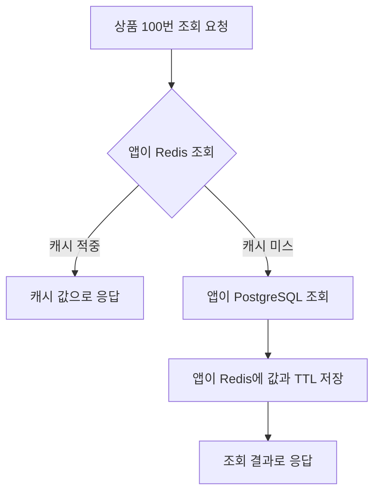

# Redis 기본 개념

작성일: 2026-09-30

Redis는 데이터를 주로 메모리에 두고, 키와 자료구조별 명령어로 읽고 변경하는 데이터 저장 서버다. 빠른 조회를 위한 캐시, 세션 저장, 카운터, 랭킹 등에 활용한다. 이번 노트는 Redis의 역할과 동작을 상품 조회 예제로 이해하는 데 집중한다. [Redis 소개](https://redis.io/tutorials/what-is-redis/)

첫 학습: [1장 Redis의 정체](01-Redis의-정체.md)에서 메모리 저장, 명령 실행, 이벤트 루프와 I/O 멀티플렉싱을 다룬다.

부록: [Redis 클라이언트 라이브러리](부록-Redis-클라이언트-라이브러리.md)에서 Lettuce의 연결 공유와 호출 방식, Redisson과의 차이, Spring Boot 자동 설정을 참고한다.

## 1 메모리에 저장한다는 의미

Redis의 기본 읽기와 쓰기는 메모리에서 이뤄진다. 저장된 값을 찾을 때마다 디스크에서 데이터를 읽는 비용을 피할 수 있어 낮은 응답 지연에 유리하다. 다만 PostgreSQL 같은 관계형 DB도 메모리에 데이터를 캐싱하므로, 둘의 차이를 단순히 메모리와 디스크의 차이로만 설명할 수는 없다. [Redis 소개](https://redis.io/tutorials/what-is-redis/), [PostgreSQL 공유 버퍼](https://www.postgresql.org/docs/current/runtime-config-resource.html#RUNTIME-CONFIG-RESOURCE-MEMORY)

상품 상세 응답을 이미 만들어 Redis에 저장했다면, 다음 요청은 DB 조회와 응답 데이터 조립을 줄일 수 있다. 이것은 **이 예제에서 기대하는 효과**이며, 실제 효과는 조회 빈도·값 크기·네트워크 비용에 따라 측정해야 한다.

Java의 `HashMap`과 비교하면 역할이 더 잘 보인다.

| 구분 | 앱 안의 HashMap | 별도 Redis 서버 |
| --- | --- | --- |
| 데이터 위치 | 해당 Java 프로세스의 메모리 | Redis 프로세스의 메모리 |
| 여러 앱의 접근 | 앱마다 별도 값이 생김 | 같은 Redis와 키를 사용해 값을 공유 가능 |
| 접근 방법 | Java 메서드 호출 | 네트워크로 명령어 전송 |
| 운영 시 고려 | 앱의 메모리와 생명주기 | 연결 실패·지연·Redis의 메모리와 복구 설정 |

이 비교는 구조를 이해하기 위한 것이다. Redis를 호출할 때는 네트워크 비용이 있으므로, 앱 내부 메모리 접근보다 항상 빠르다는 뜻은 아니다.

## 2 키와 값 그리고 자료구조

**키는 데이터를 찾는 이름이고, 값은 그 이름에 저장된 데이터다.** 예를 들어 `product:100`이라는 키에 상품 100번의 상세 응답을 저장할 수 있다. 콜론은 애플리케이션에서 이름을 구분하는 관례이며, 폴더를 자동으로 만들어주지는 않는다.

값은 문자열 하나뿐 아니라 필드 묶음, 목록, 집합처럼 구조를 가질 수 있다. 먼저 아래 다섯 가지를 익힌다. 용도는 이 저장소에서 사용할 수 있는 학습 예시다. [Redis 자료구조](https://redis.io/docs/latest/develop/data-types/)

| 자료구조 | 저장 형태 | 학습 예시 | 대표 명령어 |
| --- | --- | --- | --- |
| String | 바이트열 하나 | 상품 응답을 JSON 문자열로 저장, 조회 수 카운터 | `SET`, `GET`, `INCR` |
| Hash | 필드와 값의 묶음 | 상품 이름과 가격을 필드로 저장 | `HSET`, `HGET` |
| List | 순서가 있는 문자열 목록 | 최근 본 상품 목록 | `LPUSH`, `LRANGE` |
| Set | 중복 없는 문자열 집합 | 사용자가 찜한 상품 ID | `SADD`, `SISMEMBER` |
| Sorted Set | 중복 없는 항목과 점수 | 상품 점수에 따른 랭킹 | `ZADD`, `ZRANGE` |

String에 JSON을 넣는 것은 JSON **텍스트**를 저장하는 것이다. 이 경우 Redis는 JSON 내부의 가격 필드를 자동으로 해석하지 않는다. 필드별 접근이 필요하면 Hash 같은 구조를 검토한다. [String 설명](https://redis.io/docs/latest/develop/data-types/strings/)

다음은 `redis-cli`에 입력하는 형태의 개념 예제다. 아직 실행하지 않았다.

```text
SET product:100 '{"name":"Cream","price":12000}' EX 60
GET product:100
TTL product:100
```

첫 명령은 상품 데이터를 String으로 저장하면서 60초 후 만료되도록 설정한다. `GET`은 값을 읽고, `TTL`은 남은 만료 시간을 초 단위로 확인한다. [SET 명령어](https://redis.io/docs/latest/commands/set/), [TTL 명령어](https://redis.io/docs/latest/commands/ttl/)

## 3 상품 조회에 캐시를 사용하는 흐름

**캐시**는 다시 조회하거나 계산하는 비용을 줄이기 위해 보관하는 데이터다. 이 예제에서는 PostgreSQL을 상품 원본의 기준 저장소로 두고 Redis에 조회용 사본을 저장한다.

앱이 Redis를 먼저 확인하고, 데이터가 없을 때 DB에서 읽어 채우는 방식을 **Cache Aside**라고 한다. Redis에 원하는 데이터가 있으면 **캐시 적중**, 없으면 **캐시 미스**다. [AWS 캐시 패턴](https://docs.aws.amazon.com/whitepapers/latest/database-caching-strategies-using-redis/caching-patterns.html)



첫 요청은 Redis 조회에 이어 DB 조회와 캐시 저장까지 필요할 수 있다. 이후 같은 상품을 찾는 요청이 캐시에 적중하면 DB 조회를 줄일 수 있다. **이 흐름에서 DB를 조회하고 캐시를 채우는 주체는 애플리케이션**이다. Redis에 DB 주소만 설정한다고 자동으로 동기화되지는 않는다. [AWS 캐시 패턴](https://docs.aws.amazon.com/whitepapers/latest/database-caching-strategies-using-redis/caching-patterns.html)

## 4 TTL과 오래된 데이터

**TTL은 키의 남은 수명**이다. 만료 시간이 지나면 해당 키는 조회할 수 없게 된다. 예제의 60초는 설명을 위한 값이며 실제 서비스의 권장값은 아니다. [EXPIRE 명령어](https://redis.io/docs/latest/commands/expire/)

학습 예제로 다음 상황을 생각해본다.

1. Redis에 가격 12,000원을 저장하고 TTL을 60초로 설정한다.
2. 10초 후 DB의 가격을 10,000원으로 변경한다.
3. 캐시를 변경하지 않으면, 만료 전 요청은 기존 가격 12,000원을 받을 수 있다.

**TTL을 설정해도 DB 변경이 즉시 반영되지는 않는다.** 최신 값을 얼마나 빨리 보여줘야 하는지에 따라 DB 변경 후 캐시를 삭제하거나 갱신하는 방식을 설계해야 한다. 캐시 데이터의 유효 기간과 갱신 정책을 함께 다루는 이유다. [AWS 캐시 유효성](https://docs.aws.amazon.com/whitepapers/latest/database-caching-strategies-using-redis/cache-validity.html)

동시 요청의 문제도 예제로 생각할 수 있다. 요청 A가 DB의 이전 가격을 읽은 뒤, 요청 B가 가격을 바꾸고 캐시를 삭제했다고 하자. 이후 A가 이전 가격을 캐시에 저장하면 오래된 값이 다시 남는다. 이처럼 삭제 한 번으로 모든 정합성 문제가 해결되지는 않는다. 해결 방법의 실험은 후속 학습으로 둔다.

일반 `GET`으로 읽는 것만으로 TTL이 연장되지는 않는다. 또한 옵션 없이 `SET`으로 값을 덮어쓰면 기존 만료 설정이 사라진다. 캐시 값을 다시 저장할 때도 만료를 어떻게 유지할지 정해야 한다. [EXPIRE 명령어](https://redis.io/docs/latest/commands/expire/), [SET 명령어](https://redis.io/docs/latest/commands/set/)

TTL과 별개로 **메모리 부족에 따른 축출 Eviction**도 있다. 설정한 메모리 한도를 넘으면 정책에 따라 키를 제거하거나, 메모리를 늘리는 쓰기 명령을 오류로 거절할 수 있다. 따라서 TTL 60초를 설정했다고 반드시 60초 동안 값이 남아 있는 것은 아니다. [Redis 축출 정책](https://redis.io/docs/latest/develop/reference/eviction/)

## 5 원자적인 명령과 여러 단계의 작업

**원자적**이라는 말은 다른 요청이 작업 중간에 끼어들어 일부 상태를 관찰하거나 변경하지 못한다는 뜻이다. `INCR`은 현재 정수 값을 읽어 1 증가시키는 일을 하나의 원자적 명령으로 처리한다. [INCR 명령어](https://redis.io/docs/latest/commands/incr/)

앱에서 `GET → 1 증가 → SET`을 따로 수행하면 같은 효과를 보장하지 못한다. 다음은 두 요청이 겹치는 학습 예제다.

| 순서 | 요청 A | 요청 B |
| --- | --- | --- |
| 1 | `GET`으로 10을 읽음 | |
| 2 | | `GET`으로 10을 읽음 |
| 3 | `SET`으로 11을 저장 | |
| 4 | | `SET`으로 11을 저장 |

두 번 증가하려 했지만 결과는 11이다. 두 요청이 각각 `INCR`을 수행하면 같은 키의 값은 12가 된다. **개별 명령의 원자성과 애플리케이션의 여러 단계 작업의 원자성은 구분해야 한다.** [Redis 트랜잭션의 동시 갱신 예제](https://redis.io/docs/latest/develop/using-commands/transactions/)

Redis에는 `MULTI`와 `EXEC`으로 명령들을 묶어 실행하는 트랜잭션도 있다. 다만 실행 도중 어떤 명령이 실패했다고 이미 수행한 다른 명령을 관계형 DB처럼 롤백하지는 않는다. Redis 작업과 PostgreSQL 작업이 자동으로 하나의 트랜잭션이 되는 것도 아니다. [Redis 트랜잭션](https://redis.io/docs/latest/develop/using-commands/transactions/)

## 6 재시작과 데이터 보존

메모리에 있는 데이터는 해당 프로세스가 종료되면 사라진다. Redis는 다시 복구할 수 있도록 디스크에 저장하는 **영속화** 기능을 제공한다. **RDB**는 특정 시점의 데이터 스냅샷이고, **AOF**는 쓰기 작업을 기록해 재시작 때 재생하는 방식이다. 복구 가능한 범위와 비용은 설정에 따라 달라진다. 이 설명은 Redis 엔진 일반 기능이며 회사 ElastiCache의 지원·설정 상태를 뜻하지 않는다. [Redis 영속화](https://redis.io/docs/latest/operate/oss_and_stack/management/persistence/)

**복제**는 다른 Redis 서버에 데이터를 복사하는 것이다. Redis OSS의 기본 복제는 비동기 방식이므로 복제본 조회에 지연이 있을 수 있고, 장애 전환 시 최근 쓰기를 잃을 가능성도 있다. 복제본이 있다고 모든 데이터 손실이 방지되는 것은 아니다. [Redis 복제](https://redis.io/docs/latest/operate/oss_and_stack/management/replication/)

이 학습에서 상품 캐시는 DB에서 다시 만들 수 있는 사본이다. 반면 세션이나 Redis에만 저장한 카운터는 없어졌을 때 영향이 다르다. **무슨 데이터를 저장하는지에 따라 유실 허용 범위와 복구 방법을 정해야 한다.**

## 이해를 확인할 질문

1. Redis가 앱 내부 `HashMap`과 다른 점은 무엇인가?
2. 상품 조회가 캐시 미스라면 누가 DB를 읽고 Redis에 저장하는가?
3. TTL이 60초인데도 최신 가격이 아닐 수 있는 이유는 무엇인가?
4. `GET → 증가 → SET`과 `INCR`은 동시 요청에서 어떻게 다른가?
5. 상품 캐시와 세션이 사라졌을 때 서비스에 미치는 영향은 어떻게 다른가?

다음 단계는 로컬에서 String·TTL·카운터의 동작을 직접 확인하는 것이다. 실행 환경과 실험 결과는 별도의 실습 기록에 남긴다.

관련 문서: [공부 목표](공부%20목표.md), [전시 캐시와 운영](../08-전시-도메인/04-캐시-성능과-운영/공부%20목표.md), [상품 랭킹](../11-랭킹-도메인/공부%20목표.md).
